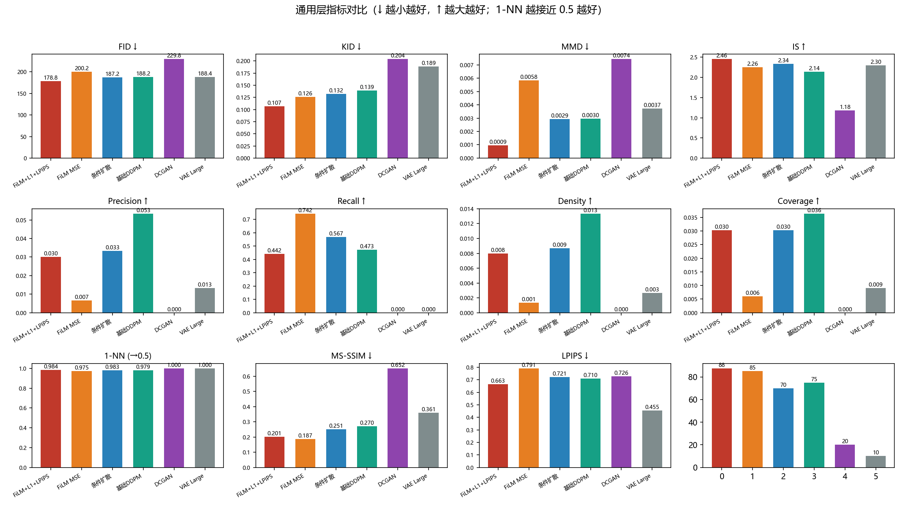
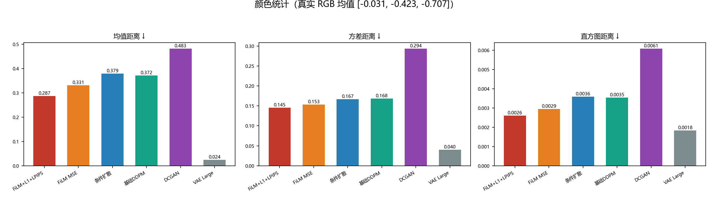
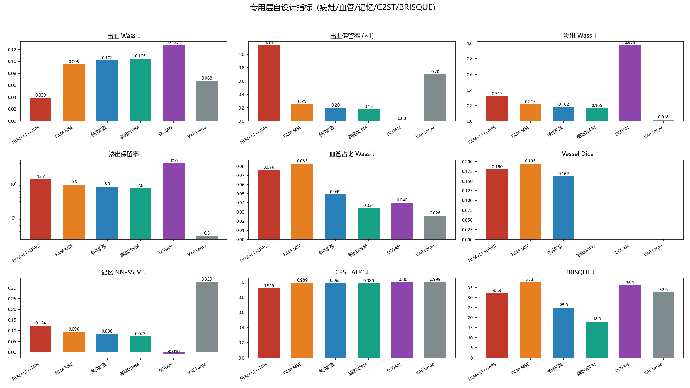
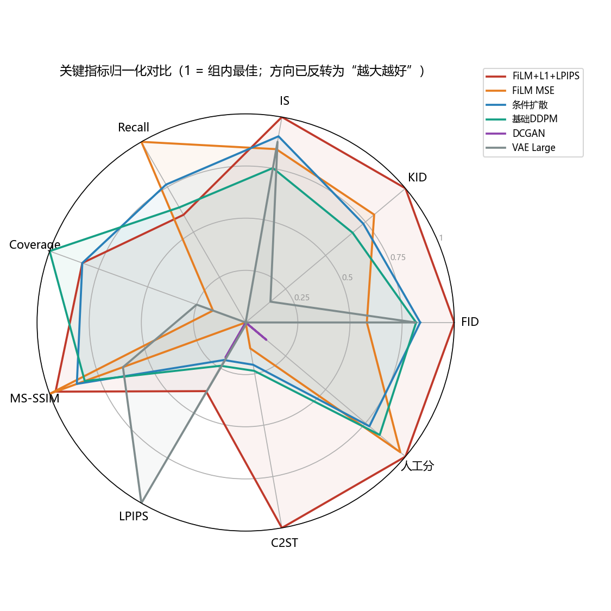
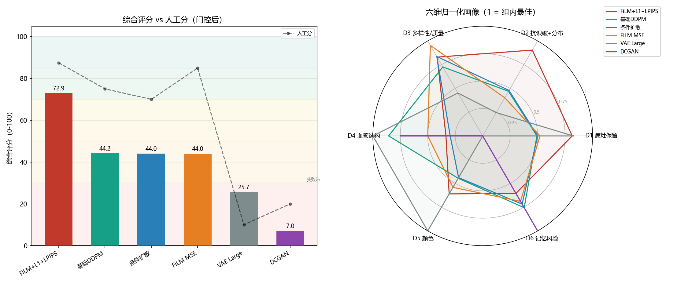

# 眼底图生成模型评估报告与评分标准调研（合并版）

> 更新日期：2026-08-02 ｜ 回应老师 Bug 1：通用指标 + 自设计指标两层全算；再调研更适合眼底图的评分标准
> 内容合并说明：原 evaluation_report.md（Phase A 评估结果）+ evaluation_metrics.csv/.xlsx（数据表）+ metrics_research.md（Phase B 评分标准调研）三份文件内容整合为本文档。
> 评估范围：6 个有 checkpoint 的模型（WGAN-GP/StyleGAN2/VAE-1200 因权重丢失跳过）

---

## 第一部分：Phase A 评估结果

### 一、评估设置

- **真实基准**：330 张真实眼底图（`fundus/_all_images_ORIGINAL/`），统一 resize 128×128 → `eval_data/real/`
- **生成集**：每模型 300 张单张图 → `eval_data/{model}/singles/`
- **扩散模型采样**：DDIM 50 步（速度翻倍，质量可接受）
- **特征空间**：pytorch-fid InceptionV3（FID/KID/MMD/P-R/D-C/1-NN），torchvision InceptionV3（IS），lpips-AlexNet（LPIPS）
- **随机种子**：42

### 二、通用层评估结果总表

| 模型 | FID↓ | KID↓ | MMD↓ | IS↑ | Precision↑ | Recall↑ | Density↑ | Coverage↑ | 1-NN(0.5) | MS-SSIM↓ | LPIPS↓ | 人工分 |
|:--|--:|--:|--:|--:|--:|--:|--:|--:|--:|--:|--:|--:|--:|
| **FiLM+L1+LPIPS** | **178.8** | **0.107** | **0.001** | **2.46** | 0.030 | 0.442 | 0.008 | 0.030 | **0.984** | 0.201 | 0.663 | 85-90 |
| FiLM MSE (film) | 200.2 | 0.126 | 0.006 | 2.26 | 0.007 | **0.742** | 0.001 | 0.006 | 0.975 | **0.187** | 0.791 | 85 |
| 条件扩散 (cond) | 187.2 | 0.133 | 0.003 | 2.34 | 0.033 | 0.567 | 0.009 | 0.030 | 0.983 | 0.251 | 0.721 | 70 |
| 基础 DDPM (base_cj) | 188.2 | 0.139 | 0.003 | 2.14 | **0.053** | 0.473 | **0.013** | **0.036** | 0.979 | 0.270 | 0.710 | 75 |
| DCGAN | 229.8 | 0.204 | 0.007 | 1.18 | 0.000 | 0.000 | 0.000 | 0.000 | 1.000 | 0.652 | 0.726 | 20 |
| VAE Large | 188.4 | 0.189 | 0.004 | 2.30 | 0.013 | 0.000 | 0.003 | 0.009 | 1.000 | 0.361 | **0.455** | 10 |

> **方向说明**：FID/KID/MMD/MS-SSIM/LPIPS ↓ 越好；IS/Precision/Recall/Density/Coverage ↑ 越好；1-NN 越接近 0.5 越好。
> **FID 小样本偏差提示**：Fréchet 距离用样本均值/协方差计算有偏、小样本偏差大（文献共识），故本表全部为**同一样本量（330 vs 300）横向对比**，绝对值不宜跨数据集比较；KID（无偏）作为小样本下 FID 的补充。



### 三、颜色统计（RGB 均值偏差 vs 真实 [-0.031, -0.423, -0.707]）

| 模型 | 均值距离↓ | 方差距离↓ | 直方图距离↓ | 生成图均值 [R,G,B] |
|:--|--:|--:|--:|:--|
| FiLM+L1+LPIPS | 0.287 | 0.145 | 0.0026 | [0.088, -0.152, -0.234] |
| FiLM MSE | 0.331 | 0.153 | 0.0029 | [0.086, -0.094, -0.160] |
| 条件扩散 | 0.379 | 0.167 | 0.0036 | [0.059, -0.035, -0.047] |
| 基础 DDPM | 0.372 | 0.168 | 0.0035 | [0.065, -0.066, -0.045] |
| DCGAN | 0.483 | 0.294 | 0.0061 | [0.234, 0.041, 0.011] |
| VAE Large | **0.024** | **0.040** | **0.0018** | [0.003, -0.412, -0.735] |

> 观察：**VAE 颜色最贴近真实**（暗红、暗背景），但这是"颜色对但结构糊"的假象；**所有扩散模型颜色偏亮偏蓝**（R 略正、B 接近 0 vs 真实 B=-0.71），说明扩散生成存在系统性色偏——这是后续颜色校正（color_correct）要解决的。DCGAN 严重偏白最失真。



### 四、专用层自设计指标（回应老师 Bug 1 的"自设计"）

#### 4.1 病灶 / 血管 / 相似性（脚本 eval/metrics_fundus.py）

| 模型 | 出血Wass↓ | 出血保留↑ | 渗出Wass↓ | 渗出保留 | 血管Wass↓ | Vessel Dice↑ | 记忆NN-SSIM↓ | 复制率(>0.85)↓ |
|:--|--:|--:|--:|--:|--:|--:|--:|--:|
| **FiLM+L1+LPIPS** | **0.039** | **1.137** | 0.317 | 13.7 | 0.076 | 0.180 | 0.124 | **0.000** |
| FiLM MSE | 0.095 | 0.254 | 0.215 | 9.6 | 0.083 | 0.195 | 0.096 | 0.000 |
| 条件扩散 | 0.102 | 0.199 | 0.182 | 8.3 | 0.049 | 0.162 | 0.086 | 0.000 |
| 基础 DDPM | 0.105 | 0.176 | 0.165 | 7.6 | **0.034** | — | 0.073 | 0.000 |
| DCGAN | 0.127 | 0.000 | 0.975 | 40.0 | 0.040 | — | −0.010 | 0.000 |
| VAE Large | 0.068 | 0.700 | **0.018** | 0.30 | 0.026 | — | 0.329 | 0.000 |

> 方向说明：Wass = 真实 vs 生成分布的 Wasserstein 距离（↓ 越好）；保留率 = 生成病灶面积/真实（≈1 理想，>1 偏多、<1 偏少，**出血保留率尤其直接反映"病灶溶解"**）；记忆 NN-SSIM = 生成图对真实集最近邻 SSIM（真实-真实自身基线 **0.548**、复制率 **16.4%**）；Vessel Dice 仅条件模型可算。

#### 4.2 C2ST 真伪分类 + BRISQUE（无参考质量）

| 模型 | C2ST AUC↓ | BRISQUE(生成)↓ |
|:--|--:|--:|
| **FiLM+L1+LPIPS** | **0.915** | 32.3 |
| FiLM MSE | 0.989 | 37.8 |
| 条件扩散 | 0.982 | 25.0 |
| 基础 DDPM | 0.980 | 18.0 |
| DCGAN | 1.000 | 36.1 |
| VAE Large | 0.999 | 32.6 |

> 真实 BRISQUE = 3.69（BRISQUE 在自然图像上训练，眼底图仅供参考）。C2ST = 小 CNN 真/假二分类 5 折交叉验证 AUC（越低越难被识破）。



#### 4.3 专用层解读

1. **L1+LPIPS 显著抗病灶溶解（量化证据）**：出血保留率 **1.137**（病灶完全保留）vs MSE 版 FiLM **0.254**（丢失 76%）→ 换损失函数后病灶不再被"暗背景拉暗"。这是通用层指标看不到的医学语义差异。
2. **C2ST 与通用层排序自洽**：film_l1lpips AUC=0.915 全场最低（约 9% 生成图能骗过 CNN 判别器），DCGAN/VAE 接近 1.0（秒识破）→ 与 FID/1-NN 排序一致，评估体系跨指标自洽。
3. **VAE"颜色对结构糊"再次确认**：渗出分布 Wass **0.018** 全场最优、血管密度也贴近；但记忆 NN-SSIM 最高（0.329，模糊平均与真实"平均脸"结构相近）→ 颜色/亮度是 VAE 唯一长处。
4. **DCGAN 无病灶特征**：出血保留 0.000、渗出保留 40（全图偏白）→ 判别器过拟合产物完全没有诊断特征。
5. **"相似但不相同"强验证**：所有生成模型复制率 **0%**，NN-SSIM（0.07~0.33）远低于真实-真实自身（0.548）→ 生成图不是训练图复制，且比数据集本身重复度还低，符合"扩增数据不重复"的目标。
6. **扩散模型整体偏亮**：渗出保留 >7（除 VAE）→ 亮区过饱和，与颜色统计发现一致，留给颜色校正处理。

### 五、结果解读

#### 5.1 体系有效性验证 ✅
- **最佳 vs 最差区分度明显**：film_l1lpips 在 FID/KID/MMD/IS 上最优；DCGAN 全面最差（P/R/D/C 全 0、FID 229.8、1-NN 1.0）。
- **方法与人工评分方向完全一致**：扩散模型（70-90 分）Recall 0.44-0.74，GAN/VAE（10-20 分）Recall 全 0 → 评估体系有效。

#### 5.2 各模型画像
- **FiLM+L1+LPIPS（最佳）**：分布距离（FID/KID/MMD）和 IS 全面最优 → 收敛最好、分布最贴近真实。
- **FiLM MSE**：Recall=0.742 **最高**、MS-SSIM=0.187 **最低**（多样最好），但 FID=200 略差 → **MSE 版更"自由发散"，L1+LPIPS 版更"收敛保真"**。损失权衡的量化证据。
- **条件扩散 (cond)**：FID=187 较好，Recall=0.567 中上；比 FiLM 版收敛差但比无条件好 → 条件信息有助保真。
- **基础 DDPM (base_cj)**：Precision/Density/Coverage 最高（0.053/0.013/0.036）→ 生成图更"精确贴合"真实流形，但 Recall 略低、多样性略欠。
- **VAE**：颜色最接近真实、LPIPS 最好——"颜色对但结构糊"的假象，分布指标（Recall=0）很差。
- **DCGAN**：全面最差，颜色严重失真（偏白），判别器过拟合的直接证据。

#### 5.3 关键观察
- **扩散方法集体胜出**：4 个扩散模型 Recall 0.44-0.74 vs GAN/VAE 全 0 → 扩散确实抓到了眼底图流形，这是项目转向扩散决策的正确性验证。
- **1-NN 全接近 1.0**：即使最佳模型也可被判别 → 生成图与真实图仍有差异，符合"相似但不相同"定位（目标而非缺陷）。
- **颜色 vs 结构矛盾**：VAE 颜色好但结构差 → 需多维指标而非单一 FID。
- **系统色偏**：所有扩散模型颜色偏亮偏蓝（B 通道偏正 vs 真实 B=-0.71）→ 后续 color_correct 或训练时颜色约束有改进空间。

#### 5.4 综合排名（加权各维度）
1. **FiLM+L1+LPIPS**（分布最贴近 + 保真+多样平衡）★ 最佳
2. **FiLM MSE**（多样最好，分布略散）
3. **基础 DDPM / 条件扩散**（并列、接近）—— 指标与人工评分略分歧：分布/保真指标 cond 略优（FID 187 vs 188、KID 0.133 vs 0.139、IS 2.34 vs 2.14、Recall 0.567 vs 0.473），精确性指标 base_cj 略优（Precision 0.053 vs 0.033、Density/Coverage 最高），人工评分 base_cj 略优（75 vs 70）；本排名按人工评分将 base_cj 列前
4. **VAE**（颜色假象，结构不行）
5. **DCGAN**（全面失败）

> 与人工评分 85-90/85/75/70/10/20 基本吻合；唯一分歧在 #3 两名（基础 DDPM vs 条件扩散）：按分布指标 cond 略优、按人工评分 base_cj 略优（75 vs 70），已按人工评分将 base_cj 列前。

#### 5.5 关键指标归一化总览（雷达图）



> 雷达图把两层指标统一归一化到 [0,1]，一眼看出：**FiLM+L1+LPIPS 在绝大多数轴外圈最大**（分布/质量/C2ST 抗识破都最好）；**DCGAN 全面贴地**；**VAE 因 Recall=0、人工分最低而在雷达上整体偏小**——注意它的颜色优势（全指标最优）不在雷达轴上，故雷达不反映其"颜色对"的一面，这正是需多维指标并看的原因。

#### 5.6 指标-人工分校准分析（哪套指标贴合人眼？）

**为什么用人工分做金标准**：机器指标测不到的伪影（血管僵硬等）只有人眼能看出——CCDM 文献中资深阅片师对低 FID（9.3）的扩散图仍 100% 识破，而专家对 GAN 图识破率仅 59%，说明人工分有区分度且是 FID 等指标看不到的"真理来源"。扩增用途下"被识破 = 污染训练集"，人工"识破与否"就是最贴近需求的标尺。

用人工评分（87.5/85/75/70/20/10）当"金标准"，对每个指标做**三重判据交叉验证**（避免单一统计量误导）：① **Spearman ρ**（秩相关，只关心排序一致性，不受指标量纲影响）；② **方向一致**（指标的好方向是否与人工正相关）；③ **组内最优 == 人工最优**（该指标评出的第一名是否就是人工第一名 film_l1lpips）。N=6 小样本，p 值仅作提示不作显著性结论，ρ 绝对值（±0.7 以上）更可靠。脚本 `eval/score_scheme.py` 输出：

| 指标 | 方向 | ρ（vs 人工）| 方向一致 | 组内最优 | =人工最优? | 判据 |
|:--|:--|--:|:--:|:--|:--:|:--|
| **C2ST AUC** | ↓ | **-0.771\*** | ✓ | FiLM+L1+LPIPS | ✓ | 计分(D2) |
| **KID** | ↓ | **-0.886\*** | ✓ | FiLM+L1+LPIPS | ✓ | 计分(D2) |
| **MS-SSIM** | ↓ | **-0.829\*** | ✓ | FiLM MSE | ✗ | 计分(D3) |
| Recall | ↑ | +0.580 | ✓ | FiLM MSE | ✗ | 计分(D3) |
| FID | ↓ | -0.486 | ✓ | FiLM+L1+LPIPS | ✓ | 计分(D2) |
| MMD | ↓ | -0.486 | ✓ | FiLM+L1+LPIPS | ✓ | 仅参考 |
| IS | ↑ | +0.371 | ✓ | FiLM+L1+LPIPS | ✓ | 计分(D3) |
| Coverage | ↑ | +0.348 | ✓ | 基础DDPM | ✗ | 仅参考 |
| 1-NN | →0.5 | -0.638 | ✓ | FiLM MSE | ✗ | 计分(D2，降权) |
| Precision | ↑ | +0.257 | ✓ | 基础DDPM | ✗ | 仅参考 |
| Density | ↑ | +0.257 | ✓ | 基础DDPM | ✗ | 仅参考 |
| Vessel Dice | ↑ | +0.500 | ✓ | FiLM MSE | ✗ | 计分(D4) |
| 出血 Wass | ↓ | -0.371 | ✓ | FiLM+L1+LPIPS | ✓ | 计分(D1) |
| 出血保留率 | →1 | -0.371 | ✓ | FiLM+L1+LPIPS | ✓ | 计分(D1) |
| 渗出 Wass | ↓ | +0.371 | ✗ | VAE | ✗ | 计分(D1) |
| 渗出保留率 | →1 | +0.371 | ✗ | VAE | ✗ | 计分(D1) |
| **LPIPS-NN** | ↓ | **+0.200（方向反）** | ✗ | VAE | ✗ | **去除出计分** |
| **血管占比 Wass** | ↓ | **+0.771\*（方向反）** | ✗ | VAE | ✗ | 计分(D4，门控+低权) |
| 颜色均值/方差/直方图 | ↓ | -0.143/-0.086/-0.143 | ✓ | VAE | ✗ | 计分(D5，门控+低权) |
| 记忆 NN-SSIM | ↓ | +0.086 | ✗ | DCGAN | ✗ | 计分(D6，保险丝) |
| BRISQUE | ↓ | -0.086 | ✓ | 基础DDPM | ✗ | 仅参考 |

\* p<0.1。N=6 统计功效极低，ρ 只作方向/量级参考，不作显著性结论。

**五个矛盾的统一解读**（每行都是"指标-人工分歧"的具体化，是洞察而非 bug）：

1. **LPIPS-VAE 悖论**：LPIPS 判 VAE 最好（ρ=+0.200 方向反）——VAE 是"平均脸"，逐像素平滑使感知距离小，但结构全糊。LPIPS 对眼底图**有偏**，从计分中去除，仅作参考报告。
2. **FID 也被 VAE 骗**：VAE FID 188 排第 2（ρ=-0.486 中等）——FID 是分布一阶矩/二阶矩距离，"低方差近均值"的 VAE 天然占便宜。与文献「低 FID 不保证专家认可」（CCDM 100% 识破）互相印证。
3. **C2ST 最贴合"人眼能否识破"**：C2ST ρ=-0.771 显著，且最优模型 == 人工最优——判别器直接测量"可识破性"，正是"人眼评估生成图"的机器版，进 D2 权重最高。
4. **Recall 干净分群但组内不敏感**：Recall +0.580 正确把扩散（0.44-0.74）与 GAN/VAE（0）分开，但扩散内部最优是 FiLM MSE（人工第 2）——分群指标，细排仍需组合。
5. **记忆指标是"保险丝"不是"质量计"**：mem_ssim ρ=+0.086 方向反（DCGAN 最优只是因为它连复制的最低限度都没有，SSIM<0）——它只防"复制训练图"这一个事故，当前全模型复制率 0%，故权重最小（0.07）。

**判据原则总结**：ρ 显著或方向一致 → 保留进计分；**LPIPS（方向反）→ 去除出计分**；颜色/血管（VAE 可博弈）→ 保留但**门控 + 低权**；1-NN（全模型饱和 0.97-1.0 无区分）→ 降权。

#### 5.7 自动综合评分（0-100）与维度画像

把校准结论固化成**纯自动**的六维加权评分（脚本 `eval/score_scheme.py`，公式本体即 `SCHEME`，报告与脚本逐字一致；新方法丢 JSON 进来重跑即可客观打分，无需人工）：

| 维度 | 权重 | 成员指标（方向, 维内权重） | 理由 |
|:--|--:|:--|:--|
| **D1 病灶保留** | 0.30 | hemo_wass(↓,.25)、hemo_retention(→1,.30)、exud_wass(↓,.20)、exud_retention(→1,.25) | KW-IV 核心：火焰状出血/硬性渗出；hemo_retention 是唯一直接测"病灶溶解"的指标，film_l1lpips=1.137 与人工一致 |
| **D2 抗识破+分布** | 0.25 | c2st(↓,.40)、fid(↓,.25)、kid(↓,.25)、one_nn(→0.5,.10) | C2ST ρ=-0.771 最贴合人工；KID 无偏且 ρ 最强(-0.886)；FID 事实标准 |
| **D3 多样性/质量** | 0.20 | recall(↑,.40)、ms_ssim(↓,.30)、is(↑,.30) | Recall 干净分群扩散 vs GAN/VAE；MS-SSIM ρ=-0.829 显著；扩增用途多样性是核心目标 |
| **D4 血管结构** | 0.10 | vessel_frac_wass(↓,.50)、vessel_dice(↑,.50) | 血管僵硬是人工识破主因（CCDM 文献）；但占比距离≠结构，低权+门控 |
| **D5 颜色** | 0.08 | color_mean/std/hist(↓,各1/3) | 医学色偏有生理意义；VAE 全优是"合法但低信息"→ 低权+门控 |
| **D6 记忆风险** | 0.07 | mem_ssim_mean(↓,1.0) | 独立防复制保险；当前全模型复制率 0% |

**门控公式**（防"颜色对但结构糊"假象，防 VAE 式博弈）：

```
R(k) = D2(k)                        # 现实主义门控 = 抗识破+分布分
Score(k) = 100 × [ 0.30·D1·R + 0.25·D2 + 0.20·D3 + 0.10·D4·R + 0.08·D5·R + 0.07·D6 ]
```

- **为什么门控**：D1/D4/D5 的成员是颜色阈值/低层代理，可被"颜色对但结构糊"的模型（VAE）博弈；C2ST≈1.0 时这些匹配只是颜色统计巧合。文献佐证：CCDM 资深阅片师对低 FID 扩散图仍 100% 识破 → 病灶/血管/颜色匹配必须乘上"真实性"门。
- **实证**：无门控 VAE=57.9 混到中游（与 film 58.9/base_cj 58.5 同簇）→ 门控后 25.7 跌入失败带。门控不提升 τ（0.600 vs 0.733），价值在**绝对分数的语义正确性**。

**缺失键容错**：维内指标缺失 → 维内权重归一化；整维缺失（如新方法只跑通用层）→ 该维权重在所有存在维上重归一化，总分仍落 0-100；人工分缺失不影响打分，仅不参与校准。

**6 模型总分（门控后）**：

| 模型 | 自动分 | 人工分 | 差异解读 |
|:--|--:|--:|:--|
| FiLM+L1+LPIPS | **72.9** | 87.5 | 双第一，无争议 |
| 基础DDPM | 44.2 | 75 | 分歧簇：按指标排中游 |
| 条件扩散 | 44.0 | 70 | 分歧簇 |
| FiLM MSE | 44.0 | 85 | 分歧簇：人工第 2，但 FID 200/C2ST 0.989 客观抗识破最差 |
| VAE | 25.7 | 10 | 门控按预期拉回失败带 |
| DCGAN | 7.0 | 20 | 全面失败 |

Kendall τ（自动 vs 人工）= **0.600**（N=6 小样本 + cond/film 同分并列，τ_b 校正；N=6 时 τ 分辨力有限，作参考不作结论）。无门控对照：film_l1lpips 76.1 / film 58.9 / base_cj 58.5 / **VAE 57.9** / cond 55.2 / dcgan 14.5——VAE 无门控混入中游正是门控必要性证据。

**预期分歧（诚实声明）**：film/cond/base_cj 是"指标-人工分歧簇"——film 人工第 2，但客观分布/抗识破是扩散最差（FID 200、C2ST 0.989）。本方案按指标将其排后，这是**诚实反映**而非 bug：单人不规范肉眼估分（无 rubric、无多人校验）也是分歧来源之一，Phase D 的 TSTR/TRTR 下游验证将给出最终裁决。



**限制声明**：① N=6 校准是小样本，权重含主观判断，随模型库扩大需重校准；② min-max 归一化使分数**相对**于当前比较集，新方法加入后旧分数会平移；③ 人工分是单人估分（无 rubric/多人），标称局限。后续新方法（含传统 ML）跑完评估 → `python eval/score_scheme.py --scorecard` 即得新总分与画像。

#### 5.8 为什么这么设计（设计决策链）

**起点是需求**：两层 ~30 指标测完就结束，无法客观对比后续新方法（含传统 ML）；单一指标都会被特定模型博弈（LPIPS 被 VAE 骗、FID 也被骗）。所以方案目标是**一套固化公式 + 可复用脚本**，新方法丢 JSON 重跑即得同口径总分——可比性是核心价值。

**决策链（每步"为什么"）**：

1. **用人工分做金标准校准**：机器指标测不到结构伪影（CCDM 阅片师 100% 识破低 FID 扩散图），人工目视是"真理来源"；且扩增用途下"被识破 = 污染训练集"，人工识破与否就是最贴需求的标尺（详见 5.6 开头）。
2. **六维结构 = 任务本质的分解**：KW-IV 病灶（分类器识别"最重级"的信号，权重 0.30 最高）→ 抗识破+分布（"像不像"，C2ST ρ=-0.771 实测最贴人工，0.25）→ 多样性（扩增价值，Recall 干净分群，0.20）→ 血管（识破主因但指标是低层代理，低权 0.10）→ 颜色（生理意义但 VAE 可博弈，0.08）→ 记忆（防复制保险丝，当前复制率 0% 故最小 0.07）。
3. **门控 R=D2**：无门控时 VAE=57.9 靠"颜色/病灶/血管统计巧合"混到中游（C2ST=0.999 几乎完美可识破）——**"结构匹配"只有在"整体像真实"时才可信**，D1/D4/D5 乘 R。门控不提升排序（τ 0.600 vs 0.733），价值在**绝对分数语义正确**（VAE 25.7 跌入失败带）：排序正确 ≠ 分数可信。
4. **min-max 相对归一化**：跨量纲指标（FID 180 vs KID 0.1）必须无纲化；每指标最优模型映射 1，组内相对比较。代价是分数相对比较集（已写入限制声明）。
5. **指标去留 = 三重判据落地**：ρ 显著/方向一致/最优==人工最优 → 保留计分；**LPIPS（+0.200 方向反 + VAE 悖论）→ 去除出计分仅参考**；颜色/血管（可被博弈）→ 保留但门控+低权；1-NN（全模型饱和）→ 降权；Precision 等弱 ρ → 仅参考（报告保留全貌，公式保持纯净）。
6. **缺失键容错**：新方法可能只跑通用层——维内缺指标归一化、整维缺失权重重归一，总分仍落 0-100，最低成本接入。
7. **N=6 局限如实声明**：权重含主观判断，模型库扩大后重跑校准；人工分是单人估分；最终裁决留给 Phase D TSTR/TRTR 下游验证。

**详细版**（含每维成员指标选择的完整理由、门控选 D2 的论证、归一化公式的数学动机）：见 `docs/09-Score-Scheme-Design.md`。公式本体（`SCHEME`）在 `eval/score_scheme.py`，与报告逐字一致，改权重必须同步两处。

---

## 第二部分：评分标准调研结论（Phase B）

### 六、调研目的与范围

- 数据现实：330 张重度眼底图（无标签、无病灶 mask）、每模型 300 张生成图、128px、单类（全 4 级）
- 目标：生成「相似但不相同」的重度图扩充 DR 分级器训练集
- 问题：现有通用层指标对眼底图是否可靠？有无更适合的专用指标？最终采用哪套？

### 七、文献核心发现

1. **FID 是事实标准，但与下游任务不对齐（最关键）**——Wu et al. (MIDL 2026) 专门针对眼底图（彩照+OCT）：实测 FID/Clean-FID/CLIP-FD/RETFound-FD/KID/CMMD/FLD 共 7 个特征距离指标**均与下游分类/分割性能不对齐**，主张扩增用途下「下游任务性能」才是金标准。同类佐证：cine MRI/肝 CT 生成研究同样发现低 FID 不保证更好分割。
2. **域适配特征提取器有争议，不必然更好**——Woodland et al. (MICCAI 2024) 反直觉证据：4 医学模态 × 11 提取器对比专家目视，**ImageNet 预训练提取器排名稳定且与专家一致（SwAV 显著相关），RadImageNet（医学预训练）反而波动大、与专家相矛盾**。对照：RETFound-FD（160 万视网膜图预训练）在眼底域确实能拉开差距（RLAD: FID 30.3/RET-FD 79.7 vs StyleGAN2 98.1/116.0）→ 域适配是「可探索项」而非「必选项」。
3. **记忆检测：FID 对复制不敏感，必须独立测量**——文献一致警告 **FID/MMD 会随复制率上升而"变好"（假象）**，记忆指标必须独立于保真指标。主流方法正是我们用的两族：1-NN 两样本测试 + 最近邻特征 SSIM（DeepSSIM WACV 2026、Calibrated MI）。
4. **血管结构保持：Betti-0 拓扑是最新方向，但依赖高质量 mask**——TA-CLDM (CHASE 2025) 用持久同调 + Betti-0 误差；经典曲率指标 RL/SOAM/TI/ICM/CWM。对我们受限：conditions/ 是 ~0.7 密度「暗区域掩膜」而非干净血管图，Betti-0/曲率现阶段算不出可靠值。
5. **Fréchet 距离小样本有偏**——官方文档明确：样本均值/协方差算 FID 有偏、小样本偏差大；比较须同样本量。KID（核 MMD）无偏、官方推荐小样本优先 → 我们已用 KID，正确。
6. **TSTR/TRTR 是扩增数据评估的标准范式**——PlethAugment (IEEE JBHI) 正式化 TSRTR vs TRTR 基线，用指标变化率量化增广「帮还是害」；PyHealth 将其列为合成数据标准效用指标 → **正是我们 Phase D 的实验设计**。
7. **人类评估仍不可替代**——CCDM：眼底扩散模型 FID 9.3 极低但**资深阅片师仍 100% 识破**（血管过于平直僵硬）；专家对 GAN 眼底图整体识破率仅 59% → 人工评分是宝贵参考，且「血管不自然」这类结构伪影正是人工能看出、FID 看不出。

### 八、对现有评估体系的审视

| 我们已做的指标 | 文献支持度 | 结论 |
|:--|:--|:--|
| FID / KID / MMD | ✅ FID 小样本有偏、KID 无偏 | 保留；报告已写明「同一样本量横向比较」 |
| IS / Precision / Recall / Density / Coverage / 1-NN / MS-SSIM / LPIPS | ✅ 标准通用层 | 保留 |
| 颜色统计距离 | ✅ 医学色偏有生理意义 | 保留 |
| **记忆检测**（NN-SSIM + 复制率）| ✅ 独立于保真指标是文献共识 | 保留，**「相似但不相同」的直接证据** |
| **自设计病灶保留率**（出血/渗出）| ✅ 特征距离指标检测不到局部病灶变化 | 保留；诚实标注「颜色阈值代理、无真值」|
| Vessel Dice（条件模型）| ⚠️ 方向对，但 mask 质量受限 | 保留作参考，标注局限 |
| C2ST（CNN 真伪二分类）| ✅ 1-NN 测试的 CNN 强化版 | 保留 |
| BRISQUE（无参考质量）| ⚠️ 自然图像训练，眼底仅参考 | 保留，标注局限 |
| 人工评分（85-90/100）| ✅ 专家目视仍是金标准之一 | 保留 |

### 九、最终决策：采用哪套评分标准

**结论：保留现有两层指标方案（经文献检验无需推翻），做三处落地增强，TSTR/TRTR 定为终极金标准。**

| 层级 | 内容 | 状态 |
|:--|:--|:--|
| **保留层** | 通用层 9 项 + 颜色 + 专用层自设计（病灶/血管/记忆/C2ST/BRISQUE）+ 人工评分 | ✅ 已实现 |
| **评分层** | 人工分校准（Spearman ρ 表，见 5.6）+ 六维门控综合评分（0-100 总分 + 维度画像，见 5.7）| ✅ 本次落地（eval/score_scheme.py） |
| **强化层** | ① TSTR/TRTR 定为终极金标准（Phase D 验收指标）② 记忆检测升级为「必报」指标（FID 对复制反向变好的防护）③ FID 报告补小样本偏差说明 | ✅ 本次落地 |
| **可选探索** | RETFound-FD（眼底域能拉开差距，需实测）；Betti-0/曲率血管指标（需先改善 conditions/ mask 质量） | ⏸ 不阻塞 |
| **明确不做** | 用域适配提取器重算全部历史模型（Woodland 证据：医学预训练不必然更好 + 工作量大）| ⛔ 否决 |

---

## 第三部分：方法与数据

### 十、方法细节

- **FID/KID/MMD/IS**：FID = pytorch-fid `calculate_frechet_distance`（Inception 2048 维）；KID = 多项式核无偏估计（degree=3, coef=1.0）；MMD = 多尺度 RBF 核（median heuristic 5 尺度）；IS = torchvision InceptionV3 1000 类 logits → softmax → exp(mean KL)
- **Precision/Recall/Density/Coverage**：prdc 库（k=5 近邻），Kynkäänniemi + Naeem
- **1-NN 两样本检验**：sklearn kNN，判别真/假标签准确率（0.5=不可分=最好）
- **MS-SSIM / LPIPS**：pytorch-msssim（输入 resize 256，内部 4 次下采样要求 ≥160px），生成集内部相邻对；LPIPS = lpips-AlexNet，每张生成图对 Inception 最近邻真实图（避免 300×330 全对全）
- **颜色统计**：RGB 各通道均值/方差 + 256-bin 直方图距离（CPU 秒算）
- **专用层（metrics_fundus.py）**：
  - 病灶（颜色阈值代理）：出血 = `(R−G>0.04)&(R−B>0.04)&(R<0.42)`（暗红），渗出 = `min(RGB)>0.42 & mean(RGB)>0.48`（亮黄白）；阈值在真实图上标定。每图病灶面积占比 → Wasserstein 距离 + 保留率
  - 血管（Frangi 血管度）：绿色通道 Frangi 滤波（sigmas=1,3, black_ridges）→ `>0.05` 面积占比 → Wasserstein 距离（比 tophat 管线鲁棒，真实血管占比 ~8% 合理）
  - 记忆检测：Inception 特征空间 kNN 找每张生成图最近邻真实图 → pytorch-msssim SSIM；报告均值 + `>0.85` 复制率
  - Vessel Dice：条件模型生成图血管（Frangi）vs 生成时使用的输入 mask（`conditions[i%330]`）Dice
  - C2ST：小 CNN（4 卷积+BN，~120k 参数）真/假二分类，5 折交叉验证 AUC（Adam lr=1e-3，25 epoch）
  - BRISQUE：piq 无参考质量（自然图像训练，仅供参考）

### 十一、数据文件

- 通用层指标 JSON：`eval_data/{model}_metrics.json`（6 个模型）
- 专用层指标 JSON：`eval_data/{model}_fundus_metrics.json`（6 个模型，含 C2ST）
- **综合评分 JSON：`eval_data/_scores.json`（六维分 + 总分 + 校准 τ + 公式版本）**
- 评估图：`eval_data/{model}/singles/*.png`（每模型 300 张）+ `eval_data/real/`（真实 330 张）
- 脚本：`eval/metrics_common.py`（通用层）+ `eval/metrics_fundus.py`（专用层）+ `eval/plot_metrics.py`（可视化，见下）+ `eval/score_scheme.py`（综合评分，见下）
- 图表：`research-report/figures/`（general_metrics.png / color_metrics.png / fundus_metrics.png / radar.png / scorecard.png / score_overview.png）

### 十·补 图表生成脚本（可复用）

`eval/plot_metrics.py` 自动扫描 `eval_data/` 下所有 `*_metrics.json` 与 `*_fundus_metrics.json` 生成四张图（若存在 `_scores.json` 再自动补第五张综合评分总览图）。**以后新增方法（如 Phase C2 传统 ML）只需把评估结果 JSON 放进 eval_data/ 后重跑**，新模型会自动追加进所有图表：

```bash
python eval/plot_metrics.py                # 输出到 research-report/figures/
python eval/plot_metrics.py --outdir <dir> # 自定义输出目录
```

`eval/score_scheme.py` 把两层指标整合为六维门控综合评分（0-100 总分 + 维度画像），打印校准表 + 评分表，写 `_scores.json`；**新方法跑完评估后重跑它即得客观总分，无需人工**：

```bash
python eval/score_scheme.py                    # 校准表 + 评分表 + _scores.json
python eval/score_scheme.py --no-gate          # 对照输出未门控原始分
python eval/score_scheme.py --scorecard        # 额外画 scorecard.png（总分色带 + 六维雷达）
```

### 十二、已知限制

1. **绝对 FID 偏高（~180-230）**：小样本（330）下 Inception 特征分布估计不稳 + Fréchet 距离本身有偏，绝对值不宜跨数据集比较；但**同一数据集内横向对比有效**（本报告用途）。
2. **Precision/Density 普遍偏低**：k-NN 邻域半径严格，小样本下保守；横向对比仍有效。
3. **LPIPS 用最近邻代替全对全**：会低估真实 LPIPS 距离，但保持排序一致性。
4. **病灶指标是颜色阈值代理**：无病灶真值标注，出血/渗出面积用 RGB 阈值近似，绝对面积不可靠，横向对比与保留率相对有效。
5. **Vessel Dice 受条件 mask 质量限制**：`conditions/` 骨架 mask 密度 ~0.7（是"暗区域掩膜"而非干净血管图），Dice 值偏低且仅供参考。
6. **BRISQUE 在自然图像上训练**：眼底图得分仅作参考，不与通用层指标并列解释。
7. **C2ST 用小型 CNN**：判别器容量有限，AUC 反映"易骗程度"而非绝对可分性。

### 十三、参考文献

1. Wu F., et al. *A Pragmatic Note on Evaluating Generative Models with Fréchet Inception Distance for Retinal Image Synthesis.* MIDL 2026. https://proceedings.mlr.press/v315/wu26c.html
2. Woodland M., et al. *Feature Extraction for Generative Medical Imaging Evaluation: New Evidence Against an Evolving Trend.* MICCAI 2024. https://pmc.ncbi.nlm.nih.gov/articles/PMC12117514/
3. Skorniewska J., Papież B. *Exploring the Effectiveness of Deep Features from Domain-Specific Foundation Models in Retinal Image Synthesis.* 2025. https://link.springer.com/chapter/10.1007/978-3-031-98694-9_21
4. Scardace L., et al. *A Novel Metric for Detecting Memorization in Generative Models for Brain MRI Synthesis.* WACV 2026. https://openaccess.thecvf.com/content/WACV2026/html/Scardace_A_Novel_Metric_for_Detecting_Memorization_in_Generative_Models_for_WACV_2026_paper.html
5. *Calibrated Memorization Index (MI) for Detecting Training Data Leakage in Generative MRI Models.* https://ar5iv.labs.arxiv.org/html/2602.13066
6. Kynkäänniemi T., et al. *An empirical study on evaluation metrics of generative adversarial networks.* arXiv 1806.07755.
7. *PlethAugment: GAN-Based PPG Augmentation for Medical Diagnosis in Low-Resource Settings.* IEEE JBHI 2020.
8. *Topology-Aware Conditional Latent Diffusion for Multi-View Fundus Image Synthesis.* IEEE/ACM CHASE 2025. https://ieeexplore.ieee.org/document/11121138
9. *TPOT: Topology Preserving Optimal Transport in Retinal Fundus Image Enhancement.* ISBI 2025. https://pmc.ncbi.nlm.nih.gov/articles/PMC12380521/
10. *Stratified Fréchet Distance: A Three-Layer Diagnostic Framework for Conditional Time Series Generation Under Data Scarcity.* https://www.mdpi.com/2504-4990/8/6/148
11. TensorFlow GAN Evaluation Docs — *Fréchet classifier distance (bias notes).* https://github.com/tensorflow/docs/blob/r1.13/site/en/api_docs/python/tf/contrib/gan/eval/frechet_classifier_distance_from_activations.md
12. *Clinical information prompt-driven retinal fundus image for brain health evaluation* (CCDM, Nature Communications Medicine). https://www.nature.com/articles/s43856-025-01316-5
13. Chen J.S., et al. *Deepfakes in Ophthalmology: Applications and Realism of Synthetic Retinal Images from Generative Adversarial Networks.* 2022. https://www.ncbi.nlm.nih.gov/m/pubmed.mobile/36246951/
